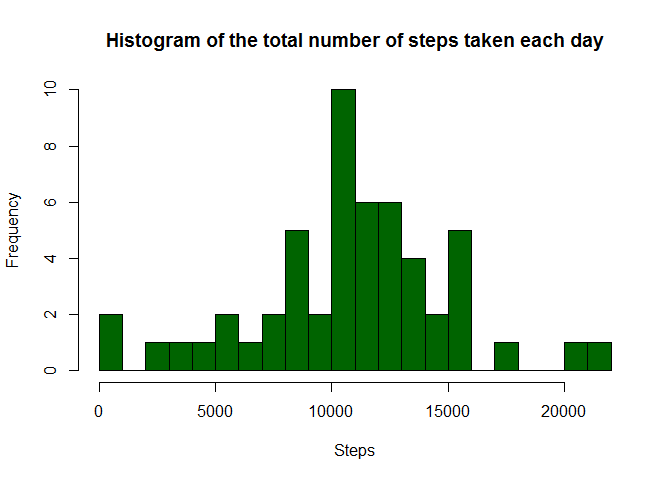
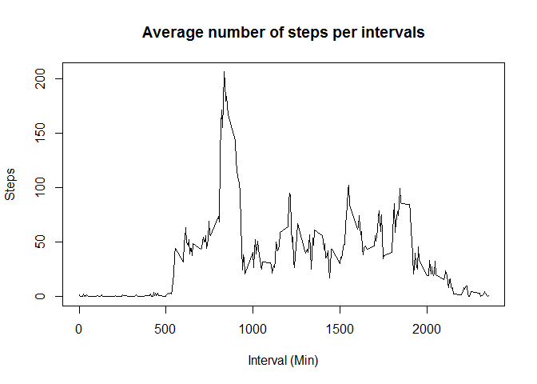
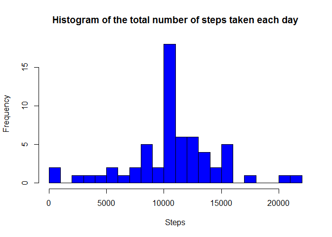
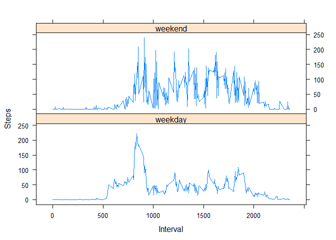

# Reproducible Research: Peer Assessment 1


## Loading and preprocessing the data
Load the data

```r
data <- read.csv("activity.csv", colClasses = c("numeric", "character","integer"))
head(data)
```

```
##   steps       date interval
## 1    NA 2012-10-01        0
## 2    NA 2012-10-01        5
## 3    NA 2012-10-01       10
## 4    NA 2012-10-01       15
## 5    NA 2012-10-01       20
## 6    NA 2012-10-01       25
```
Process the data into a suitable format for analysis

```r
data$date <- as.POSIXct(data$date, format="%Y-%m-%d")
```

## What is mean total number of steps taken per day?
1. Total number of steps taken per day

```r
steps_Day <- aggregate(data=data, steps~date, FUN=sum)
head(steps_Day)
```

```
##         date steps
## 1 2012-10-02   126
## 2 2012-10-03 11352
## 3 2012-10-04 12116
## 4 2012-10-05 13294
## 5 2012-10-06 15420
## 6 2012-10-07 11015
```

2. Histogram of the total number of steps taken each day

```r
library(ggplot2)
```

```
## Warning: package 'ggplot2' was built under R version 3.2.4
```

```r
hist(steps_Day$steps,
     breaks=20,
     col="darkgreen", 
     xlab="Steps", 
     ylab="Frequency", 
     main="Histogram of the total number of steps taken each day")
```

<!-- -->

3. Mean and median of the total number of steps taken per day. We ignore the missing values in the dataset.
Mean of the total number of steps taken per day

```r
mean(steps_Day$steps)
```

```
## [1] 10766.19
```
Median of the total number of steps taken per day

```r
median(steps_Day$steps)
```

```
## [1] 10765
```
## What is the average daily activity pattern?
Time series plot of the 5-minute interval (x-axis) and the average number of steps taken, averaged across all days (y-axis)

```r
## Mean of the numeber of steps per each interval
five_Min <- aggregate(data=data, steps~interval, FUN=mean)
plot(x = five_Min$interval, y = five_Min$steps, type = "l",
     xlab="Interval (Min)", 
     ylab="Steps", 
     main="Average number of steps per intervals") 
```

<!-- -->

5-minute interval, on average across all the days in the dataset, which contains the maximum number of steps?

```r
index <- which(five_Min$steps == max(five_Min$steps))
five_Min[index,1]
```

```
## [1] 835
```

## Imputing missing values
Calculate and report the total number of missing values in the dataset

```r
NAs <- sum(is.na(data))
NAs
```

```
## [1] 2304
```
Devise a strategy for filling in all of the missing values in the dataset. The strategy does not need to be sophisticated. For example, you could use the mean/median for that day, or the mean for that 5-minute interval, etc.
Create a new dataset that is equal to the original dataset but with the missing data filled in.

```r
# The strategy used is the the mean for the 5-minute interval
new_Data <- data 
for (i in 1:nrow(new_Data)) {
    if (is.na(new_Data$steps[i])) {
        new_Data$steps[i] <- five_Min[which(new_Data$interval[i] == five_Min$interval), ]$steps
    }
}

sum(is.na(new_Data))
```

```
## [1] 0
```

```r
head(new_Data)
```

```
##       steps       date interval
## 1 1.7169811 2012-10-01        0
## 2 0.3396226 2012-10-01        5
## 3 0.1320755 2012-10-01       10
## 4 0.1509434 2012-10-01       15
## 5 0.0754717 2012-10-01       20
## 6 2.0943396 2012-10-01       25
```

Make a histogram of the total number of steps taken each day and calculate and report the mean and median total number of steps taken per day. Do these values differ from the estimates from the first part of the assignment? What is the impact of imputing missing data on the estimates of the total daily number of steps?

```r
steps_Day2 <- aggregate(data=new_Data, steps~date, FUN=sum)
hist(steps_Day2$steps,
     breaks=20,
     col="blue", 
     xlab="Steps", 
     ylab="Frequency", 
     main="Histogram of the total number of steps taken each day")
```

<!-- -->

```r
## Mean
mean(steps_Day2$steps)
```

```
## [1] 10766.19
```

```r
## Median
median(steps_Day2$steps)
```

```
## [1] 10766.19
```
The values for the mean and median are the same. However, the mean value does not differ from the data frame with missing values.

## Are there differences in activity patterns between weekdays and weekends?
Creration of a new factor variable in the dataset with two levels - "weekday" and "weekend" indicating whether a given date is a weekday or weekend day.

```r
data <- cbind(data, day_type = ifelse(tolower(weekdays(data$date)) == c("saturday", "sunday"), "weekend", "weekday"))
```
Panel plot containing a time series plot (i.e. type = "l") of the 5-minute interval (x-axis) and the average number of steps taken, averaged across all weekday days or weekend days (y-axis). See the README file in the GitHub repository to see an example of what this plot should look like using simulated data.

```r
library(lattice)
## Mean of the numeber of steps per each interval
five_Min2 <- aggregate(data=data, steps~interval+day_type, FUN=mean, na.rm=TRUE)
xyplot(data = five_Min2, steps ~ interval | day_type, type="l",
       xlab="Interval", 
       ylab="Steps", 
       layout=c(1,2))
```

<!-- -->
